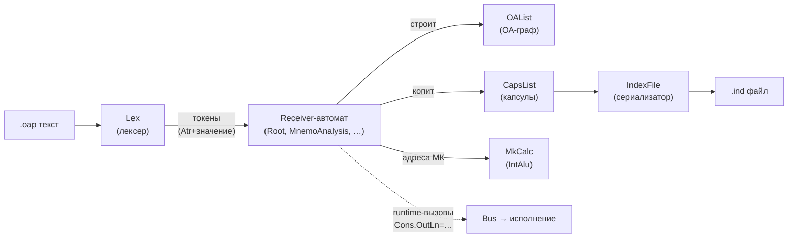
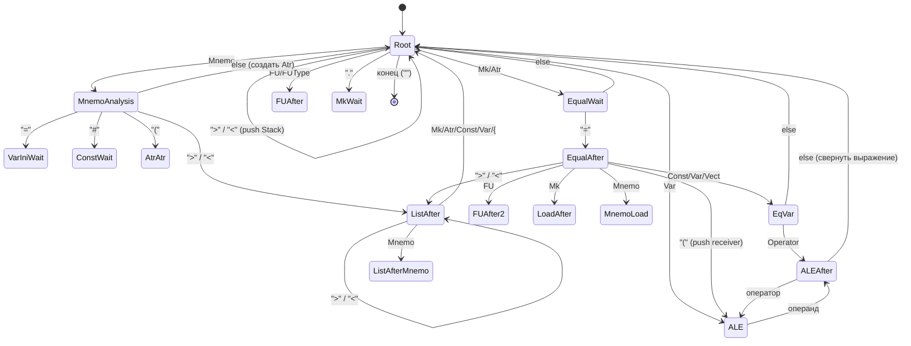
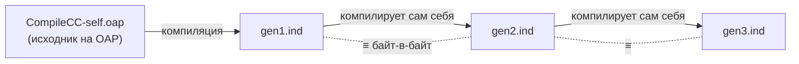

# Язык OAP (ОА-язык) и процесс компиляции CompileCC

> Отчёт по синтаксису потоково-управляемого языка OAP, модели исполнения
> на функциональных устройствах (ФУ) и шине (Bus), а также по устройству
> само-компилятора `oap2/CompileCC-self.oap`.
> Все примеры взяты из реальных `.oap`-файлов репозитория.

---

## 1. Что это вообще такое

**OAP** (от *Операционный Автомат* / OA = «operational automaton») — это не
обычный императивный язык. Это **язык управления потоком данных** (dataflow),
в котором программа — это последовательность **сообщений**, рассылаемых между
**функциональными устройствами (ФУ, *FU* — Functional Unit)** через общую
**шину (Bus)**.

Ключевая интуиция:

> В классическом языке вы пишете `x = a + b`. В OAP вы **посылаете
> микрокоманду** некоторому устройству: «устройство `IntAlu`, выполни МК
> `Add`, операнд = `b`». Программа — это граф из ФУ-узлов, соединённых
> потоками значений (`Load`).

Весь язык строится вокруг одной-единственной формы предложения:

```
<ФУ> . <МК> = <Load>
```

читается как: *«отправь устройству `<ФУ>` микрокоманду `<МК>` с полезной
нагрузкой `<Load>`»*.

Пример (`oap2/hello.oap`):

```oap
NewFU={Mnemo="Cons" FUType=FUConsNew}   // создать ФУ-консоль с именем Cons
Cons.OutLn="via Cons"                   // послать Cons микрокоманду OutLn, Load = строка
```

Здесь нет ни функций, ни переменных в привычном смысле. Есть **устройства**,
которым шлют **команды**.

---

## 2. Базовые понятия

| Термин | Что это | Аналог в обычном языке |
|--------|---------|------------------------|
| **ФУ / FU** (Functional Unit) | Объект-автомат с состоянием. Имеет тип (`FUType`) и имя (`Mnemo`). | Объект / актор |
| **МК / Mk** (микрокоманда) | Числовой код метода ФУ. У каждого типа ФУ — своя таблица МК. | Метод / opcode |
| **Мнемоника** | Человекочитаемое имя МК или ФУ (`OutLn`, `Cons`). Лексер переводит её в число. | Имя метода |
| **Bus (шина)** | Глобальный диспетчер. Хранит все ФУ и маршрутизирует МК по глобальным адресам. | Шина сообщений / VM |
| **Load** | Полезная нагрузка сообщения — то, что справа от `=`. Может быть числом, строкой, ссылкой на ФУ, или целым подграфом `{...}`. | Аргумент |
| **Atr (атрибут)** | Тип/тег значения (отрицательное число: `Mnemo=-2`, `Const=-13`, `FU=-300`…). | Тип токена |
| **ИП / IP** (Information Pair) | Пара «атрибут + значение» — атом данных в системе. | Поле |
| **ИК / IC** (Information Capsule) | «Капсула» — список ИП, т.е. структурированный фрагмент данных/кода. | AST-узел / запись |

### Глобальная адресация МК

Каждое ФУ при создании получает **диапазон МК** на шине
(`FUMkRange`). Например `Bus` сидит на `MkBegRange=1000`, `Cons` — на `2000`,
`MnemoTable` — на `5000` и т.д. Глобальный адрес микрокоманды =
`база_ФУ + локальный_номер_МК`. Так шина понимает, какому устройству
переслать вызов:

```
Cons.OutLn  →  база(Cons)=2000  +  МК(OutLn)=2  =  глобальный МК 2002
```

Это видно в `CompileCC-self.oap` в строках регистрации:

```oap
>{Mnemo="Bus"  ... Lex.SendToReceiver={FU=1000}}
>{Mnemo="Cons" ... Lex.SendToReceiver={FU=2000}}
>{Mnemo="MnemoTable" ... Lex.SendToReceiver={FU=5000}}
```

---

## 3. Типы ФУ (встроенные)

Тип задаётся константой `FU…New`. Из таблицы мнемоник компилятора:

| Тип | Константа | Назначение |
|-----|-----------|-----------|
| Bus | `FUBusNew` (0) | Шина-диспетчер |
| Console | `FUConsNew` (1) | Ввод/вывод (stdin/stdout) |
| StrGen | `FUStrGenNew` (2) | Генератор строк |
| Lex | `FULexNew` (3) | Лексический анализатор |
| Find | `FUFindNew` (4) | Поиск |
| **List** | `FUListNew` (5) | **Список ИК — главный «рабочий конь»** |
| IntAlu | `FUIntAluNew` (7) | Целочисленный аккумулятор (АЛУ) |
| InOut | `FUInOutNew` (8) | Файловый ввод/вывод |
| ALU | `FUALUNew` (17) | Векторная арифметика |
| IndexFile | `FUIndexFileNew` (26) | Сериализация в `.ind` |
| … | … | (MeanShift, Gauss, MatPlot, Router, Gateway…) |

`FUListNew` — самый важный: это универсальная таблица строк, где каждая строка
сама может быть ИК (списком ИП). На списках строятся **таблицы мнемоник**,
**стек разбора**, **накопитель ОА-графа** и почти все состояния компилятора.

### Микрокоманды (МК) — на примере List

У каждого типа ФУ — собственная таблица МК. Вот фрагмент `ListMkTable`
(полная — в `CompileCC-self.oap`, строки 106–161):

```oap
>{Mk=1   Mnemo="Set"            Hint="Заменить текущую строку новой ИК"}
>{Mk=160 Mnemo="LineAdd"        Hint="Добавить новую строку"}
>{Mk=161 Mnemo="LineCopyAdd"    Hint="Добавить строку с копированием"}
>{Mk=228 Mnemo="FindOr"         Hint="OR-поиск по строкам"}
>{Mk=229 Mnemo="FindAnd"        Hint="AND-поиск по строкам"}
>{Mk=12  Mnemo="SuccessProgSet" Hint="Программа, запускаемая при удачном поиске"}
>{Mk=23  Mnemo="SuccessExec"    Hint="Выполнить Load, если поиск удался"}
>{Mk=24  Mnemo="FailExec"       Hint="Выполнить Load, если поиск не удался"}
```

IntAlu (`IntAluMkTable`) — арифметика-аккумулятор: `Set`, `Add`, `Sub`,
`Mul`, `Div`, `Mod`, `Inc`, `Dec`, `BiggerExec`, `LessEQExec`…

Lex (`LexMkTable`) — управление лексером: `Lexing` (скормить текст),
`SendToReceiver` (отправить токен в автомат-приёмник), `ReceiverPush/Pop`
(стек приёмников для вложенного разбора), `UnicAtrSet/UnicMkSet`
(таблица «атрибут → куда диспетчеризовать токен»).

---

## 4. Синтаксис OAP — полный обзор

### 4.1. Лексика

Поток символов разбивается лексером на **токены**, каждому из которых
присваивается **атрибут (Atr)**:

| Токен | Atr | Пример |
|-------|-----|--------|
| Mnemo (идентификатор) | −2 | `Cons`, `OutLn`, `MnemoTable` |
| Const (число/строка) | −13 | `42`, `"hello"` |
| Var (ссылка на переменную) | −14 | `A`, `X` |
| FU (ссылка на ФУ) | −300 | имя зарегистрированного ФУ |
| Mk (микрокоманда) | −102 | `OutLn` после `.` |
| Sep (разделитель) | −4 | `. = { } ( ) > < , # * [ ] !` |
| Operator | −321 | `+ - * / %` |

Разделители-сепараторы (`Sep*-4` в исходнике) — это пунктуация, которая
двигает конечный автомат разбора между состояниями.

**Комментарии:** `//` до конца строки (в C++-порте есть нюанс — см. §8).

### 4.2. Создание ФУ

```oap
NewFU={Mnemo="Console" FUType=FUConsNew Hint="Консоль для вывода"}
```

`NewFU` — особая мнемоника: её строка в `MnemoTable` запускает программу,
которая через `Bus.Create` создаёт устройство, регистрирует его имя и
закрепляет за ним диапазон МК.

### 4.3. Вызов микрокоманды

Базовая форма — три варианта Load:

```oap
Cons.OutLn="строка"          // Load = строковая константа
Cons.OutLn=A                 // Load = значение переменной A
Cons.OutLn=A+B               // Load = ALE-выражение (вычисляется на этапе компиляции)
Scheduler.NCoresSet=2        // Load = целое
Eventser.ContextOutMk=Scheduler.EventserSet   // Load = ссылка на МК другого ФУ
```

Последняя форма — **соединение узлов потока данных**: «выход `Eventser`
(его контекст) направить на вход `Scheduler.EventserSet`». Именно так
строятся графы.

### 4.4. Переменные и compile-time арифметика (ALE)

```oap
A=10                 // объявить переменную-константу
B=20
Cons.OutLn=A+B       // 30 — посчитано компилятором (ALE-подавтомат)
Cons.OutLn=C/D
Cons.OutLn=C%E
```

**ALE** (*Arithmetic-Logic Expression*) — это под-автомат компилятора,
который сворачивает арифметику `+ - * / %` со скобками `( )` **во время
компиляции** в одно число. Приоритет операций реализован разбиением на
состояния `ALE` (ждём операнд) и `ALEAfter` (ждём оператор), плюс
вспомогательные `AleMulWait` / `AleDivWait` / `AleModWait` / `AleNegWait`
для умножения/деления/унарного минуса.

### 4.5. Векторы

```oap
V#1,2,3,4,5          // вектор-константа из 5 элементов (через ConstWait → VectWait)
```

`#` вводит вектор; элементы перечисляются через запятую (состояния
`VectWait` → `VectNext4` → `VectNext5`, зацикленные на запятой).

### 4.6. Списки и вложенные капсулы — `>{ … }`

Самая выразительная конструкция. `>` открывает строку списка, `{ … }` —
вложенную ИК. Так задаются таблицы:

```oap
MnemoTable.Set=
>{Mnemo="ConsOut" Lex.SendToReceiver={Mk=Console.OutLn}}
>{Mnemo="Atr"     Lex.SendToReceiver={Atr=-8}}
```

И так же задаются **программы-обработчики** (тело МК как данные):

```oap
Scheduler.SchedulingProgSet={
  FUSchedulerNew.TimeOutMk=Console.Out
  Console.Out=" "
}
```

Фигурные скобки `{}` — это **капсула-как-данные**: целый подграф вызовов,
который передаётся как Load и может быть выполнен позже (отложенное
исполнение, `…ProgSet` / `…Exec`). Это даёт языку аналог замыканий и
условных конструкций:

```oap
Stack.SuccessExec={Stack.LastDelMk  CapsDepth.Dec}   // выполнить блок, если поиск удался
MkCalc.NEQExec={ ... }                                // если аккумулятор ≠ значению
CapsDepth.LessEQExec={ ... }                          // если depth ≤ 0
```

### 4.7. Именованные таблицы и оператор `!`

Таблицу можно объявить с именем и потом «вшить» её содержимое по `!`:

```oap
>{Mnemo="Cons" MkTable.Set=ConsMkTable! ...}   // подставить ИК таблицы ConsMkTable
```

`!` = *consume*: извлечь ИК именованной переменной/таблицы и подставить её
на место (в `VarStore` строка при этом удаляется). Это механизм
макроподстановки/шаринга данных.

### 4.8. Структура программы целиком

Типичная программа состоит из трёх частей (см. `NetTemperat.oap`):

```oap
// 1. Объявления ФУ
NewFU={Mnemo="NetManager" FUType=FUNetManager}
NewFU={Mnemo="Console"    FUType=FUConsNew}

// 2. Конфигурация / соединение узлов (построение dataflow-графа)
Eventser.ContextOutMk=Scheduler.EventserSet
Scheduler.NCoresSet=2

// 3. Запуск вычисления
NetManager.NetGen
NetManager.Start=1
```

---

## 5. Как устроен компилятор `CompileCC-self.oap`

Самое интересное: **компилятор OAP сам написан на OAP**. Это не парсер на
C++, а **программа на ОА-языке**, которая разбирает текст ОА-программы и
строит её ОА-граф. C++-исполнитель (`Millicom.exe`) — лишь «железо»,
исполняющее МК; вся грамматика живёт в `.oap`.

Файл состоит из 4 крупных секций:

### 5.1. Объявление рабочих ФУ (строки 1–58)

Создаются десятки List/IntAlu-устройств, каждое из которых играет роль
**состояния автомата** или **регистра**:

```oap
NewFU={Mnemo="Root"          FUType=FUListNew}   // стартовое состояние
NewFU={Mnemo="MnemoAnalysis" FUType=FUListNew}   // состояние «после идентификатора»
NewFU={Mnemo="EqualAfter"    FUType=FUListNew}   // состояние «после =»
NewFU={Mnemo="Stack"     FUType=FUListNew}       // стек разбора скобок
NewFU={Mnemo="OAList"    FUType=FUListNew}       // накопитель строящегося ОА-графа
NewFU={Mnemo="CapsList"  FUType=FUListNew}       // накопитель капсул для эмиссии .ind
NewFU={Mnemo="MkCalc"    FUType=FUIntAluNew}     // калькулятор глобального адреса МК
NewFU={Mnemo="CapsDepth" FUType=FUIntAluNew}     // глубина вложенности капсул
NewFU={Mnemo="VarStore"  FUType=FUListNew}       // хранилище именованных переменных
```

> **Каждое состояние парсера — это отдельное ФУ типа List.** Его строки —
> это переходы автомата. Гениальность приёма: таблица переходов и движок
> их исполнения — это один и тот же механизм (List.FindAnd + MkExec).

### 5.2. Определения атрибутов и таблиц МК (строки 61–295)

```oap
Sep*-4    Var*-14    IC*-102   ...        // числовые коды атрибутов
```

Затем — `ConsMkTable`, `ListMkTable`, `LexMkTable`, `IntAluMkTable`,
`BusMkTable` и т.д. — словари «мнемоника → номер МК» для каждого типа ФУ.

### 5.3. Главная таблица мнемоник (`MnemoTable.Set`, строки 299–368)

Это **сердце лексера**: словарь, переводящий каждое слово исходного текста
либо в атрибут, либо в действие. Лексер настроен так:

```oap
Lex.UnicAtrSet=Mnemo            // уникальный слот для атрибута Mnemo
Lex.UnicMkSet=MnemoTable.FindAnd // каждый идентификатор ищется в MnemoTable
```

То есть **каждый идентификатор из входного текста прогоняется через
`MnemoTable.FindAnd`**. Если нашёлся — выполняется тело строки (например,
для `Atr` это `Lex.SendToReceiver={Atr=-8}` — отправить токен с нужным
атрибутом в автомат-приёмник).

### 5.4. Конечный автомат разбора (строки 370–1069)

Каждое состояние = `<Имя>.Set=` со списком строк-переходов. Строка-переход
матчится по входному атрибуту и делает три вещи:

1. **Переключает приёмник** на следующее состояние:
   `Lex.ReceiverMkSet=EqualWait.FindAnd`
2. **Совершает семантическое действие** (строит граф, считает адрес…).
3. **Печатает трассу** `Console.OutLn="<state> <transition>"` (она же —
   эталон для тестов).

Пример — состояние `Root` (строки 390–458), реагирующее на первый токен
предложения:

```oap
Root.Set=
>{Mnemo  Lex.ReceiverMkSet=MnemoAnalysis.FindAnd  ...  Console.OutLn="Root Mnemo"}
>{Mk Atr ConstInt Lex.ReceiverMkSet=EqualWait.FindAnd ... Console.OutLn="Root Mk/Atr"}
>{Var   Lex.ReceiverMkSet=Root.FindAnd  Lex.ReceiverPush=ALE.FindAnd ... }
>{FU FUType Lex.ReceiverMkSet=FUAfter.FindAnd ... }
>{Sep="." Lex.ReceiverMkSet=MkWait.FindOr ... }
>{Sep=">" Sep="<" ... Stack.LineCopyAdd={Sep=">"} OAList.PushTied ... }
>{Sep="}" ... Stack.FindAndLast={SubCapMark} Stack.SuccessExec={...} ... }
```

Полная карта состояний и переходов — в `grammar_graph.txt` (извлечена из
Visio-диаграммы и сверена с реализацией).

---

## 6. Процесс компиляции в терминах потока данных

Компиляция — это **конвейер из нескольких ФУ**, соединённых потоком токенов
и капсул. Вот сквозной путь от текста до `.ind`-файла.

### 6.1. Высокоуровневый конвейер



### 6.2. Пошагово

1. **Лексер (`Lex`)** читает текст через МК `Lexing` (Mk=100), режет его на
   токены и каждому слову через `MnemoTable.FindAnd` присваивает атрибут.

2. **Диспетчеризация в приёмник.** Текущее состояние-приёмник хранится в
   `Lex` (`ReceiverMkSet`). Лексер шлёт токен текущему состоянию через
   `Lex.SendToReceiver`. Состояние — это ФУ-список; `FindAnd` ищет
   подходящую строку-переход и выполняет её тело (`MkModeSet=1`).

3. **Переход состояния.** Тело строки переключает приёмник
   (`Lex.ReceiverMkSet=<NextState>.FindAnd`). Для вложенных конструкций
   используется **стек приёмников** (`Lex.ReceiverPush/Pop`) — так
   реализованы скобки, списки и ALE-выражения.

4. **Семантические действия** накапливают результат:
   - `MkCalc` (IntAlu) складывает базу ФУ и номер МК → глобальный адрес.
   - `OAList` строит дерево вызовов (узлы ОА-графа): `LastLoadSet`,
     `LastAtrSet`, `PushTied`, `LineCopyAddPrevSet`.
   - `CapsList` копит **капсулы-объявления** — то, что попадёт в `.ind`.
   - `Stack` балансирует скобки `{ } ( ) > <` через маркеры
     (`SubCapMark`, `ListOuterMark`, `MkBrack`, `Sep="("`).
   - `CapsDepth` (IntAlu) считает глубину вложенности; когда `depth==0`,
     капсула верхнего уровня готова к диспетчеризации/эмиссии.

5. **Два класса предложений** (важнейшее различие):
   - **Объявления** (`NewFU`, `Mnemo.Set=`, таблицы) → оседают в `CapsList`
     и затем **сериализуются** в `.ind`.
   - **Runtime-вызовы** (`Cons.OutLn="hi"`) → когда `CapsDepth ≤ 0`,
     немедленно **диспетчеризуются** на шину (`CapsList.MarkLastOutMk=Bus.MkExec`)
     и исполняются «вживую» — в `.ind` они **не** попадают.

   ```oap
   // фрагмент из EqVar / LoadAfter: эмиссия-или-исполнение по глубине
   MkCalc.NEQExec={ CapsDepth.LessEQExec={ CapsList.MarkLastOutMk=Bus.MkExec } }
   ```

6. **Эмиссия `.ind`.** Накопленные капсулы регистрируются в `IndexFile`
   (`CapsList.IndexVectPopMk=IndexFile.CapsListRegister`), который строит
   индексный вектор и пишет бинарный `.ind`
   (`IndexVectFromList` → `IndexVectWrite`).

### 6.3. Что захватывает `.ind`

> `.ind` содержит **только капсулы-объявления** (граф ФУ и их таблицы).
> Runtime-вызовы исполняются на лету и не сериализуются. Для компилятора
> это и есть нужное поведение: **состояние компилятора = его объявления**,
> поэтому само-скомпилированный `.ind` — это полноценный работающий
> компилятор.

### 6.4. Автомат разбора (упрощённо)



(Полный граф с состояниями `ConstWait2`, `VectWait/4/5`, `AtrAtr2/3`,
`LoadVar`, `BrackLoadVar`, `MkWait2`, `FUAfter2`, `HLPL` — в
`grammar_graph.txt`.)

### 6.5. Роль стека и под-автоматов

```mermaid
flowchart TD
    subgraph Receiver-стек Lex
        R[Root]
    end
    subgraph Stack-ФУ (балансировка)
        M1["Sep={"]
        M2["SubCapMark"]
        M3["ListOuterMark"]
        M4["Sep=("]
    end
    R -->|"встретили {"| M1
    R -->|"встретили >{ "| M2
    R -->|"встретили >"| M3
    R -->|"встретили ("| M4
    M1 -->|"встретили }"| POP1["pop + LevelPrevAdd"]
    M4 -->|"встретили )"| POP2["pop + свернуть ALE"]
```

При открытии скобки в `Stack` кладётся маркер и `CapsDepth.Inc`; при
закрытии — `FindAndLast` ищет парный маркер, `CapsDepth.Dec`, и при выходе
на верхний уровень (`depth ≤ 0`) капсула либо уходит в `VarStore`
(если это определение переменной, `VarFlag=1`), либо диспетчеризуется/
сериализуется.

---

## 7. Само-хостинг (self-hosting) и фиксированная точка

Главное достижение проекта — **байт-в-байт фиксированная точка**:



Компилятор, скомпилированный сам собой (`gen1`), компилирует свой же
исходник в идентичный `gen2`, а тот — в идентичный `gen3`. Совпадение
поколений (`gen1 ≡ gen2 ≡ gen3`) доказывает, что эмиссия `.ind`
**полностью реконструирует** рантайм-обвязку компилятора — это и есть
определение корректного само-хостинга. Тест-сьют: 60/60 разбор + 10/10
ALE на всех поколениях.

---

## 8. Особенности C++-порта (отклонения от Delphi-оригинала)

Исполнитель `Millicom.exe` (C++) воспроизводит поведение исходной
Delphi-машины не на 100%. Тест-харнес обходит это:

| Особенность | Обход в тестах |
|-------------|----------------|
| `//`-комментарии превращаются в StrAtr-токены, а не выкидываются | Раннер вырезает их регуляркой |
| Финальное состояние не срабатывает само (нет завершающего `else`) | Раннер дописывает `;` в конец |
| `>>` токенизируется как один Sep, а не два `>` | Писать через пробел: `> > Foo` |

Delphi-версия (`E:\miemp\Millicom\Millicom\LexFU.pas`) — авторитетная;
«чинить» эти места в `Lex.cpp` без сверки с ней не стоит.

---

## 9. Шпаргалка по синтаксису

```oap
// --- объявления ---
NewFU={Mnemo="Имя" FUType=FUТипNew Hint="подсказка"}   // создать ФУ

// --- вызовы МК (узлы потока данных) ---
ФУ.МК                       // вызов без нагрузки
ФУ.МК="строка"              // Load = строка
ФУ.МК=42                    // Load = число
ФУ.МК=Перем                 // Load = переменная
ФУ.МК=A+B*2                 // Load = ALE-выражение (compile-time)
ФУ.МК=ДругоеФУ.ДругаяМК      // соединить выход с входом

// --- переменные / векторы ---
A=10                        // переменная-константа
V#1,2,3,4,5                 // вектор-константа
Имя=[ A+B ]                 // ALE в квадратных скобках

// --- списки и капсулы-данные ---
Табл.Set=
>{Mnemo="ключ" Поле=значение Вложенное={...}}
>{Mnemo="ключ2" ...}

ФУ.ПрогSet={ ФУ1.МК1  ФУ2.МК2 }   // блок-замыкание как Load

// --- макроподстановка ---
МК.Set=ИменованнаяТаблица!   // вшить ИК по имени (consume)

// --- комментарий ---
// до конца строки
```

---

## 10. Где что лежит

| Файл | Что |
|------|-----|
| `oap2/CompileCC-self.oap` | **Само-компилятор** (главный, 1075 строк) |
| `oap2/CompileCC.oap` | Рабочая версия компилятора |
| `grammar_graph.txt` | Авторитетная спецификация автомата разбора |
| `oap2/hello.oap`, `oap2/tiny.oap` | Простейшие примеры |
| `tests/ale_*.oap` | Примеры выражений / пользовательских ФУ |
| `NetTemperat.oap`, `Gauss.oap`, `MeanShift.oap` | Прикладные программы (моделирование, ЦОС) |
| `Bus.cpp/.h`, `Lex.cpp`, `List.cpp`, `IntAlu.cpp` | C++-исполнитель МК |
| `Millicom.cpp` | `main`: разбор CLI, загрузка `.ind`, `--lex-file` |

---

### Резюме одним абзацем

OAP — это потоково-управляемый язык, где программа представляет собой граф
**функциональных устройств (ФУ)**, обменивающихся **микрокомандами (МК)**
через **шину**. Единственная синтаксическая форма — `ФУ.МК=Load`, а
структуры данных и блоки кода задаются капсулами `{…}` и списками `>{…}`.
Компилятор `CompileCC` сам написан на OAP: его состояния — это ФУ-списки,
переходы — строки этих списков, а разбор сводится к тому, что лексер гоняет
токены по приёмникам-состояниям, попутно строя ОА-граф в `OAList`/`CapsList`
и сериализуя объявления в `.ind`. Компилятор достигает **байт-в-байт
фиксированной точки** при само-компиляции.
```
